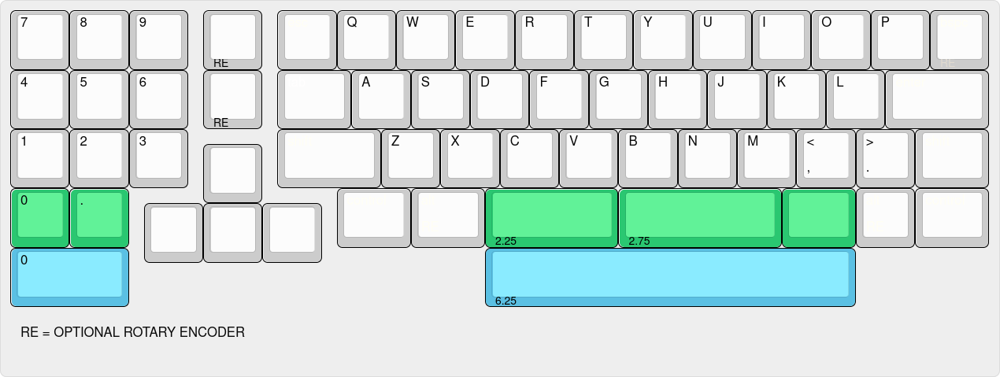
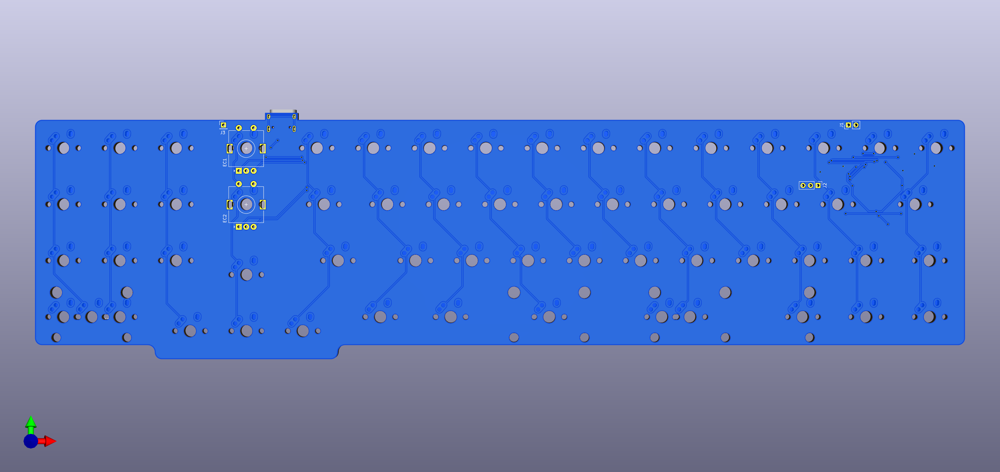
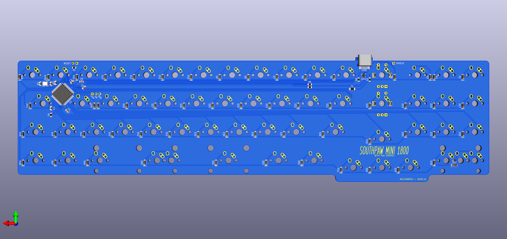

# SPM1800
This is a PCB for a southpaw mini 1800 layout keyboard with the following features:

- Big bar and split bar support
- MX or Alps style switches
- Two independent rotary encoders
- USB Type-C
- Breakout pins for RGB underglow
- Breakout pin for USB shield ground

## WARNING
This PCB has not been tested for functionality. Please review the project files prior to placing an order for manufacturing. Users should be warned that they are manufacturing this at their own risk. 

## Layout

[KLE](http://www.keyboard-layout-editor.com/#/gists/ef914cc294dadcf20cfa8c7b7239d802)

## PCB

## BOM

| Designator | Description | Package | QTY | LCSC Part Number |
|-----------|-----------|-------|-----|-----------------|
|C1, C2, C3|Capacitor - 0.1uF|0805|3|C115962|
|C5|Capacitor - 10uF|0805|1|C165459|
|D1 - D58|Diode - 1N4148|SOD-123|58|C466653|
|D59|ESD Protection Diode - PRTR5V0U2X|SOD-143B|1|C12333|
|F1|Fuse 24V - 500mA|1206|1|C70076|
|R1, R2|Resistor - 10k|0805|2|C365230|
|R3, R4|Resistor - 5.2k|0805|2|C328405|
|R5, R6|Reistor - 22|0805|2|C178169|
|U1|Atmega32u4|QFP-44_10x10mm_P0.8mm|1|C44854|
|USB1|HRO-TYPE-C-31-M-12|HRO-TYPE-C-31-M-12|1|C165948|
|Y1|Crystal 16Mhz 3.2x2.5mm, 4 pad|3225|1|C156247|

## QMK Firmware
Firmware has not been written at this time. This section will be updated when this task is completed.

## Additional Notes
This project uses KiCAD libraries maintained by ai03:

- [MX_Alps_Hybrid](https://github.com/ai03-2725/MX_Alps_Hybrid)
- [random-keyboard-parts.pretty](https://github.com/ai03-2725/random-keyboard-parts.pretty)
- [Type-C.pretty](https://github.com/ai03-2725/Type-C.pretty)

